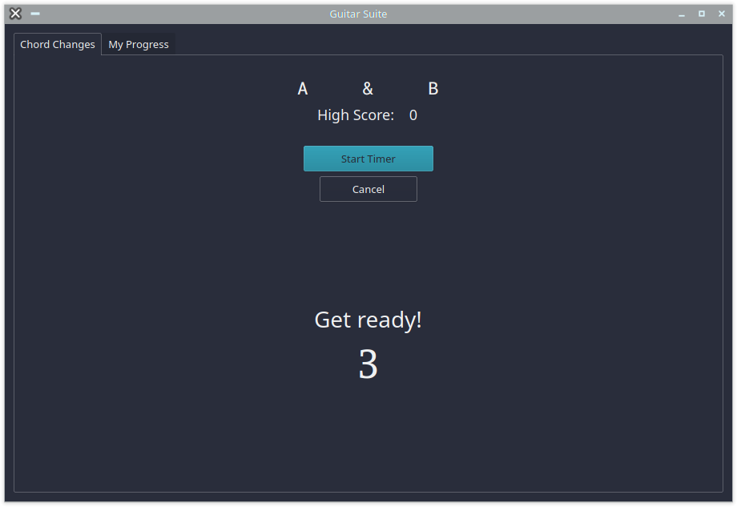
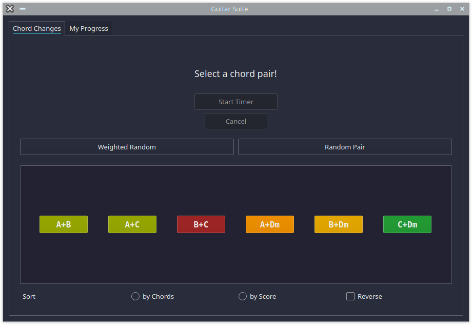

# Guitar Practice Suite

This program streamlines the monotonous parts of guitar practice.

## Practices

### 60 second chord changes
  - pick a pair of chords and play them as many times as possible in one minute.
  - record your scores to get feedback on which pairs of chords you need to work on
  - pick a random pair to play
  - weighted random: more likely to choose pairs with lower high scores

#### Screenshots
  - Enter chords you know in the tab titled 'My Progress'
  
  - Navigate to the 'Chord Changes' tab and select a pair of chords on the grid
  
  - Click 'Start Timer' to begin a session. First it runs for 3 seconds to let you get ready, then it runs for 60 seconds.
  
  - Enter the number of times you played the chords
  
  - View your results after submitting your score
  
  - Buttons in the Chord Selection screen change color depending on your high score
  
  - Return to the 'My Progress' tab when you learn more chords or to view a table with information about your play history
  

## TODO
  - Add more features to the chord changes practice
    - add a decay attribute to each chord pair - the longer it has been since you played it, the more you are urged to practice it
    - add a stats screen / widget where you can view a graph of your recent sessions
    - add sounds to the timer start and end
  - When I learn more about guitar and music theory I'll add some more features to this.
    - tools to practice chord progressions
    - scale practice
  - Add a metronome feature

## Problems
> I use regular expressions to verify that chords are valid.
> I don't actually know what all of the different kinds of chords are so the regex is incomplete. For beginners like myself this is not really a problem.
> More advanced chords like diminished, suspended, or something complicated like 'G#m7b5' will not work.
> I will update it in the future.
> I'll probably just make some variable or file containing all chords and use that instead. I'm not sure if RegEx is the best tool for the job. I just wanted to mess around with it.
